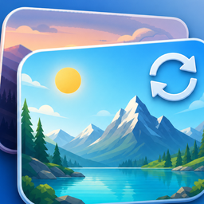

<p align="center">
  
</p>

<h1 align="center">Daily Wallpaper</h1>

<p align="center">
  必应每日壁纸、多显示器规则与本地媒体库，集中在一款轻量的原生 macOS 应用中。
</p>

<p align="center">
  <a href="https://github.com/hdheid/daily-wallpaper/releases/latest">下载最新版本</a>
  ·
  <a href="https://github.com/hdheid/daily-wallpaper/releases">查看全部版本</a>
</p>

Daily Wallpaper 是一款面向 macOS 的壁纸管理工具。你可以下载和应用必应每日图片，为不同显示器配置各自的壁纸规则，也可以把下载与导入的图片整理成一个可搜索、可预览的本地媒体库。

应用关闭主窗口后会继续驻留菜单栏，按系统事件完成每日检查，不依赖高频轮询，适合长期后台运行。

## 主要功能

### 每日壁纸

- 手动下载今日图片，或者一键下载并应用。
- 每日自动下载和每日自动更换可以分别控制。
- 支持中国、美国、日本、德国和法国市场，并保存各市场对应的标题与介绍。
- UHD 下载不可用时自动回退到必应提供的原始图片。

### 多显示器

- 自动识别当前连接的显示器、主屏和实际像素分辨率。
- 可以让全部显示器使用同一套规则，也可以分别设置国家、分辨率、缩放方式和自动更换选项。
- 媒体库会显示每台显示器当前正在使用的壁纸，并标记主屏与对应显示器。

### 本地媒体库

- 以瀑布流浏览下载和导入的图片，滚动时按需加载，不会一次读取全部文件。
- 支持按来源、国家、分辨率、日期和关键词筛选。
- 双击图片进入大图预览，可使用胶片条、方向键和 `Esc` 浏览或退出。
- 右键可以打开原图、在访达中定位、设置到全部或指定显示器，以及确认后移到系统废纸篓。
- 支持导入 JPEG、PNG、HEIC、TIFF、WebP 图片，也可以递归导入整个文件夹。

### 菜单栏与自动化

- 关闭主窗口后隐藏 Dock 图标并继续驻留菜单栏，下载和自动化任务不会因此停止。
- 从菜单栏打开媒体库或设置时，主窗口和 Dock 图标会重新出现。
- 菜单栏提供下载、下载并应用、导入、打开媒体库、查看当前图片、每日开关和退出等常用操作。
- 支持登录时启动，并在跨日、唤醒、时区变化、屏幕连接和 Space 切换时更新必要状态。

## 下载与安装

Daily Wallpaper 支持 macOS 13 及以上版本。GitHub Release 中的通用架构安装包同时支持 Apple Silicon 和 Intel Mac。

1. 前往 [Releases](https://github.com/hdheid/daily-wallpaper/releases/latest)，下载名称以 `macOS-universal.dmg` 结尾的文件。
2. 打开 DMG，将 `DailyWallpaper.app` 拖到“Applications”快捷入口。
3. 从“应用程序”目录启动 Daily Wallpaper。

当前公开版本使用 ad-hoc 签名，尚未经过 Apple 公证。首次启动如果被 macOS 拦截，请右键应用选择“打开”，或者前往“系统设置 -> 隐私与安全性”确认打开。建议只从本仓库的 GitHub Releases 页面下载安装包。

每个版本同时提供 SHA-256 校验文件。需要验证下载完整性时，将 DMG 和同名 `.sha256` 文件放在同一目录后执行：

```bash
shasum -a 256 -c DailyWallpaper-vX.Y.Z-macOS-universal.dmg.sha256
```

## 快速开始

1. **下载第一张壁纸**：启动后点击工具栏中的“下载今日图片”；需要立即设为壁纸时，选择“下载并应用”。
2. **配置显示器**：进入“显示器”，选择全部显示器共用规则或分别配置每台显示器，调整完成后点击“保存更改”。
3. **开启每日任务**：进入“自动化”，选择是否每日下载、每日更换和登录时启动，然后点击“保存更改”。
4. **浏览媒体库**：回到“媒体库”查看已经下载或导入的图片，使用顶部筛选项缩小范围。
5. **导入自己的图片**：点击工具栏中的“导入图片”，选择单张、多张图片或文件夹。

显示器和自动化页面中的设置在点击“保存更改”后才会生效，方便一次确认多项调整。下载目录的选择和移除属于文件授权操作，会即时生效。

## 下载目录

默认下载位置为：

```text
~/Pictures/dailywallpaper
```

图片会按照以下结构归档：

```text
年/月/日/国家或标签/实际分辨率
```

每张必应图片都会保存原图和同名 JSON 信息文件。不同国家返回同一张图片但标题或介绍不同时，各自的本地化信息会分别保留，不会互相覆盖。

你可以在“下载目录”页面选择其他文件夹。应用会保存 macOS 文件访问授权，重启后仍可继续使用已经添加的目录。

## 使用媒体库

“媒体库”页展示所有已归档和导入的图片；“今日壁纸”页只展示本机当天已经下载入库的必应图片。切换国家只会筛选本地记录，不会主动联网或自动下载该国家的图片。

媒体库顶部会显示各显示器当前 Space 的实际壁纸。通过系统设置在应用外更换壁纸后，Daily Wallpaper 会将其标记为“系统外部壁纸”。

删除图片前应用会显示确认窗口。确认后，原图和对应信息文件会移到系统废纸篓，而不是直接永久删除。

## 后台运行

点击主窗口左上角的红色关闭按钮不会退出 Daily Wallpaper。此时 Dock 图标会隐藏，应用继续在菜单栏运行；从菜单栏选择“打开媒体库”或“设置”即可恢复主窗口。

需要完全退出时，请从菜单栏选择“退出 Daily Wallpaper”，或在应用处于前台时使用 `Command-Q`。

应用不会定时高频请求网络。每日任务主要由跨日、系统唤醒、用户登录和相关系统状态变化触发；失败后只安排有限次数的低频重试。

## 资源占用

Daily Wallpaper 按照长期后台运行的场景设计。没有下载、导入或图片解码任务时，应用不会进行高频轮询或周期计算，CPU 占用通常接近空闲状态；只有在跨日、唤醒、屏幕变化等系统事件发生时才会执行必要检查。

- **内存**：媒体库每次只读取一页数据，并只为可见图片和少量预取项生成缩略图；内存缩略图缓存预算为 `32 MB`。关闭主窗口后，图片列表、预览任务和内存缩略图缓存会被释放，只保留菜单栏与自动化所需状态。
- **CPU**：下载、批量导入、生成缩略图和打开大图预览时会短暂升高；缩略图任务最多并发 2 个，大图预览一次只解码当前需要显示的图片。
- **磁盘**：缩略图磁盘缓存预算为 `256 MB`，原始壁纸和导入图片不计入该缓存，会保存在你选择的下载目录中。
- **网络**：图片采用流式下载，文件校验使用固定 `1 MB` 缓冲区；一次更新完成后会释放对应网络会话，不会为了保持后台运行而持续连接必应。

活动监视器中显示的总内存会受到 macOS 版本、当前页面、媒体库规模和图片尺寸影响。上面的缓存数字是应用内部预算，并不等同于整个进程的总内存占用。

## 隐私与网络

- 必应每日图片的元数据和图片文件从 `www.bing.com` 获取。
- 导入图片、媒体库索引、壁纸规则和应用设置均保存在本机。
- 应用不要求注册账户，也没有接入使用统计、广告或云同步服务。

## 常见问题

### 为什么首次打开会出现安全提示？

当前下载版本使用 ad-hoc 签名，尚未使用 Developer ID 证书和 Apple 公证。请确认安装包来自本仓库的 Releases 页面，再通过右键“打开”或“系统设置 -> 隐私与安全性”完成首次启动。

### 关闭窗口后为什么菜单栏图标还在？

这是预期行为。Daily Wallpaper 需要继续处理每日下载和壁纸更换，因此关闭窗口只会进入菜单栏模式。请使用菜单栏中的“退出 Daily Wallpaper”完全退出。

### 可以给每台显示器使用不同壁纸吗？

可以。在“显示器”页面选择分别配置，即可为每台显示器设置独立的国家、分辨率、缩放方式和自动更换选项。

### 为什么切换“今日壁纸”的国家后没有开始下载？

“今日壁纸”是本地媒体库视图，只筛选已经下载的当天记录。需要获取新图片时，请使用工具栏或菜单栏中的下载命令，或者配置对应显示器的市场并开启每日下载。

### 可以只下载而不自动更换吗？

可以。保留“每日下载”并关闭“每日更换”即可。关闭每日下载时，每日更换也会关闭，但手动下载和手动应用仍然可用。

## 反馈与建议

欢迎大家通过 [GitHub Issues](https://github.com/hdheid/daily-wallpaper/issues) 提交使用中遇到的问题、功能建议或其他反馈。提交问题时如果能附上 macOS 版本、应用版本、复现步骤和相关截图，会更有助于定位和处理。

## 从源码构建

源码构建需要 macOS 13 及以上版本，以及 Xcode 26 或兼容的 Swift 6 工具链：

```bash
./Scripts/build.sh
```

构建产物位于 `.build/Build/Products/Release/DailyWallpaper.app`。运行单元测试可执行：

```bash
./Scripts/test.sh
```

维护者发布新版本时，请参阅 [RELEASE.md](RELEASE.md)。
